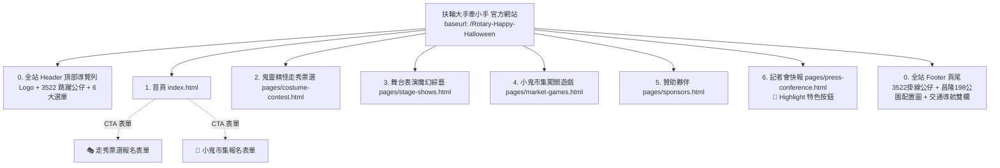

# 國際扶輪3522地區萬聖節嘉年華會
# 扶輪大手牽小手 官方網站完整建置規格書 (Website Specification)

> **專案名稱**：國際扶輪3522地區萬聖節嘉年華會・扶輪大手牽小手  
> **網站正式名稱**：扶輪大手牽小手  
> **技術架構**：Jekyll 4.4 + GitHub Pages + Liquid `_data/` 資料驅動 + Modern WebP 最佳化  
> **基本網址 (Baseurl)**：`https://luhunglieh.github.io/Rotary-Happy-Halloween/`  
> **核心精神**：扶輪精神 × 萬聖趣味 × 社區共創  
> **文件狀態**：**已與線上完成之正式網站 (Website Codebase) 100% 精準對齊**  
> **資料邊界原則**：**PPT 簡報內「第三工作會報告 (05-3)」以後之內部行政內容（三工/四工內部組織、工程報價、核銷補助等）純屬內部行政，一律不登載於公開網站。**

---

## 一、網站架構與頁面拓撲 (Site Architecture)

全站採取單一責任分頁架構，全站頁尾（Footer）完全整合昌隆 198 公園之會場平面圖、Google Maps 嵌入與交通動線，導覽結構清晰且全頁面具備 AEO 結構化資料：

---

## 二、全站共通組件規格 (Global Components)

### 2.1 頂部導覽列 (Header & Navbar)
* **實作組件**：`_includes/nav.html`
* **品牌識別與互動動效**：
  * 左側：主標誌 `assets/images/logo.webp`（扶輪大手牽小手 慈善萬聖節嘉年華）。
  * 3522 趣味公仔群：包含 4 隻獨立公仔圖標 (`digit_3.webp`, `digit_5.webp`, `digit_2a.webp`, `digit_2b.webp`)，具備隨機 800ms～2400ms 間隔上下跳躍動態特效（Hop-jump animation）。
* **導覽清單與路由 (Navigation Routing)**：
  1. **首頁** (`/`)
  2. **鬼靈精怪走秀票選** (`/pages/costume-contest.html`)
  3. **舞台表演魔幻綜藝** (`/pages/stage-shows.html`)
  4. **小鬼市集闖關遊戲** (`/pages/market-games.html`)
  5. **贊助夥伴** (`/pages/sponsors.html`)
  6. **📢 記者會快報** (`/pages/press-conference.html`，配置 `highlight: true` 專屬醒目發光按鈕樣式)
* **行動端適配**：響應式漢堡選單（Hamburger Button），點擊任一連結自動關閉展開選單。

---

### 2.2 全站頁尾 (Footer - 整合平面圖與交通導航)
* **實作組件**：`_includes/footer.html`
* **頂部懸掛裝飾**：上緣懸掛 3522 數字公仔群 (`digit_3.webp`, `digit_5.webp`, `digit_2a.webp`, `digit_2b.webp`) 吊線效果。
* **會場平面圖與交通指南雙欄卡片 (Merged Traffic Card)**：
  1. **會場全區平面配置圖區塊**：
     * 展示 `assets/images/venue-map.webp`。
     * 涵蓋：主舞台、星光伸展台走道、小鬼市集白色帳篷群、草坪大地闖關遊戲區、大會諮詢服務處、變裝更衣帳篷與救護醫療站。
  2. **即時導航與交通指引區塊**：
     * **顯著 Google 地圖按鈕 (CTA)**：直通定位「台北市大安區市民大道三段198號」。
     * **Google 地圖嵌入**：內嵌即時地圖 iframe。
     * **大眾運輸詳細指引**：
       * 🚇 **捷運系統**：忠孝新生站 4 號出口（步行 8～10 分鐘）／ 忠孝復興站 1 號出口（沿安東街步行 8～9 分鐘）。
       * 🚌 **公車路線**：忠泰美術館站（669、919 下車即達）／ 正義郵局站（忠孝幹線、204、212、232、262、299 等）／ 台北科技大學站（202、298、紅57）。
       * 🚗 **周邊停車**：Times 市民大道三段停車場（市民大道三段198號地下室 B3，棟內 24 小時辨識）／ 市民大道地下停車場（建國-復興段）／ 建國高架橋下停車場。
* **主辦聲明與版權**：
  * 主辦標誌：`assets/images/footer-logo-2.webp`。
  * 主辦單位：國際扶輪 3522 地區、天際扶輪社、環球扶輪社、忠孝扶輪社、同領扶輪社。
  * 合辦指導：台北市政府社會局、大安區昌隆里辦公處、T3ex TEC、汐游寶寶。
  * 榮譽贊助：財團法人旺台環境文化&文化教育基金會、台北市護照扶輪社。
  * 版權聲明：© 2026 國際扶輪 3522 地區 版權所有 ｜ 扶輪精神 × 萬聖趣味 × 社區共創。

---

## 三、各頁面詳細規格與建置內容 (Page Specifications)

### 3.1 首頁 (`index.html`)

* **Hero Banner**：
  * 採用 `assets/images/Banner01.webp`（桌機寬幅 1584x672）與 `assets/images/Banner01-mobile.webp`（手機適配 739x672），以 `<picture>` 標籤實踐 RWD 最佳化。
  * 疊加飛越蝙蝠氛圍動畫 (``)。
* **慈善嘉年華倒數計時器**：
  * 精確鎖定目標時間：**2026 年 10 月 24 日（六）11:00**。
  * 即時計算「天、時、分、秒」數字卡。
  * 配置兩大行動按鈕 (External Google Forms)：
    * 🎭 **報名走秀票選**：`https://docs.google.com/forms/d/e/1FAIpQLSdEDqH1mTpZKdtPk4L2om2T8uwl7tMv5pjEMLOkfME5tSlotQ/viewform`
    * 🍭 **報名小鬼市集**：`https://docs.google.com/forms/d/e/1FAIpQLSdWJINrhBLWgD7usvZtHp6l22wofL1W1Bu8dDvAOs23TziN2Q/viewform`
* **活動宗旨與四大精神（總監公訪標準規格）**：
  * 🤝 **跨域協作・公私協力**：攜手社會局與里辦公處，整合資源。
  * 🧡 **實質協助・親手服務**：全額贊助近百位受邀兒童專屬變裝服飾與園遊活動，社友牽手同行。
  * 🌟 **品格教育・價值傳承**：小鬼老闆擺攤與闖關，傳遞分享與感恩。
  * 🏛️ **形象提升・CSR實踐**：展現扶輪深耕在地形象，共創社會責任。
* **三大核心活動亮點卡片**：
  1. 🎭 鬼靈精怪伸展台投票秀 ➔ 引導至 `pages/costume-contest.html`
  2. 🎪 舞台表演與魔幻綜藝 ➔ 引導至 `pages/stage-shows.html`
  3. 🍭 小鬼市集與闖關遊戲 ➔ 引導至 `pages/market-games.html`
* **主辦單位與榮譽贊助形象牆**：
  * 嵌入 `assets/images/Sponsor-00.webp`（主辦社群與榮譽贊助旺台環境文化基金會、台北市護照扶輪社）。
  * 嵌入 `assets/images/Sponsor-01.webp`（合辦單位 T3ex、汐游寶寶與鬼王級贊助商）。
  * 提供「完整贊助夥伴資訊 →」導向 `pages/sponsors.html`。

---

### 3.2 鬼靈精怪走秀票選 (`pages/costume-contest.html`)

* **活動定位**：星光伸展台走秀競賽、人氣評選、獎金與實物獎品發布。
* **獎金階梯榜**（自 `site.data.timeline.contest_prizes` 動態渲染）：
  * 🥇 **第一名 冠軍**：新台幣 **NT$ 5,000 元**（冠名金色 Highlight）
  * 🥈 **第二名 亞軍**：新台幣 **NT$ 4,000 元**
  * 🥉 **第三名 季軍**：新台幣 **NT$ 3,000 元**
  * 🎖️ **第四名 殿軍**：新台幣 **NT$ 2,000 元**
  * 🎖️ **第五名 優勝**：新台幣 **NT$ 1,000 元**
* **4 大實物贊助好禮**（自 `site.data.sponsors.material_sponsors` 動態渲染）：
  * 兒童專用立體口罩 300 個（東湖社 趙國鈞）
  * 彩窗軌道磁力片 5 組（天際社 Fion）
  * 呈易美學牙醫潔牙組 100 組（天際社 Jiuan）
  * 炫彩遙控車 3 台（天際社 Diesel）
* **走秀票選重要時程**：
  * 11:00～14:00 現場打卡背板拍照、掃描專屬 QR Code 登錄參賽與投票。
  * **14:00 準時截票**，進行計票。
  * **14:30 揭曉各組入圍前 5 名**。
  * **15:20～15:40 登上主舞台星光伸展台走秀，總監 Auto 親自頒獎**。
* **線上報名通道**：內嵌 Google 表單直連報名按鈕。

---

### 3.3 舞台表演與魔幻綜藝 (`pages/stage-shows.html`)

* **主持陣容向左對齊資訊欄**：
  * 🎙️ 上半場主持：101 扶輪社 PP Angela ＆ 元宇宙扶輪社 PP David
  * 🎙️ 下半場主持：大仁扶輪社 Annie ＆ 環球扶輪社 Charlie
* **全日舞台節目時程表 (11:00 - 16:00)**（自 `site.data.timeline.schedule` 動態渲染）：
  * `11:00 - 11:06` 主持人暖場開場與主旨宣告
  * `11:06 - 11:23` 開幕儀式：6位妖魔鬼怪引領各分區大進場（第二現場主持 IPP Mei）
  * `11:23 - 11:25` 臺北市市長 蔣萬安 蒞臨致詞
  * `11:25 - 11:35` 「大手牽小手」大會啟動儀式 ＆ 全場大合照
  * `11:30 - 11:35` 遨兒音樂震撼打擊樂開場演出
  * `11:35 - 11:55` Auto 總監、姚淑文 局長、王志剛 里長、PP Frank 主委致詞
  * `11:55 - 12:40` 遨兒音樂：打出節奏玩出快樂互動擊樂
  * `12:40 - 13:10` 小冰綜藝特技秀：極限平衡與翻轉震撼街頭特技
  * `13:10 - 13:40` 魔幻特務馬拉將：人入巨型氣球幽默互動秀
  * `13:40 - 13:50` 🎁 **第一場萬聖幸運大抽獎 ＆ 感謝贊助商**
  * `13:50 - 14:20` 扯鈴彩虹龍：18公尺巨型七彩舞龍創新雜技（賴彥璋）
  * `14:20 - 14:40` 溜溜球金氏紀錄表演：戲劇與街頭藝術極致（楊元慶）
  * `14:40 - 15:20` 遨兒音樂：打出節奏跳出快樂全場律動
  * `15:20 - 15:40` 🏆 **鬼靈精怪伸展台 各組前 5 名走秀 ＆ 總監親自頒獎**
  * `15:40 - 15:50` 🎁 **第二場萬聖幸運大抽獎 ＆ 感謝贊助商**
  * `15:50 - 16:00` 主持群結語、活動主委致謝、嘉年華圓滿落幕
* **五大星級藝人圖文卡片**（自 `site.data.timeline.performers` 動態渲染）：
  * 小冰 (`performer-xiaobing.webp`)
  * 魔幻特務 馬拉將 (`performer-balloon.webp`)
  * 扯鈴彩虹龍 賴彥璋 (`performer-diabolo.webp`)
  * 金氏世界紀錄 楊元慶 (`performer-yoyo.webp`)
  * 遨兒音樂團隊 (`performer-music.webp`)
* **萬聖雙場次幸運大抽獎品項清冊**（自 `site.data.timeline.raffle_prizes` 動態渲染）：
  * 驚喜小動物盲盒（每場 20 名，共 40 名）
  * 沐久沐浴乳優質禮盒（每場 10 名，共 20 名）
  * 花語護手霜高級禮盒（每場 10 名，共 20 名）
  * 疾速遙控賽車（每場 6 名，共 12 名）
  * 炫彩兒童滑板車（每場 3 名，共 6 名）
  * 精選樂高積木組 LEGO（每場 1 名，共 2 名）
  * 泡泡瑪特 POP MART 潮玩公仔（每場 1 名，共 2 名）

---

### 3.4 小鬼市集與闖關遊戲 (`pages/market-games.html`)

* **市集雙主題特色卡片**：
  * 🎃 **小鬼市集 — 小老闆擺攤趣**：自主生活實踐、整理二手玩具繪本、標價叫賣與收銀找零。
  * 🎨 **奇幻魔法彩繪專區**：專業彩繪師親膚無毒人體彩繪、南瓜與萬聖精靈圖騰。
* **14 家特色設攤夥伴導覽名冊**（自 `site.data.market_booths.booths` 動態渲染）：
  1. 拍拍趣（現場拍貼機即拍即印）
  2. 茶樂（特選手作現萃冷泡茶）
  3. 花蓮銀耳露（在地小農慢火燉煮養生甜品）
  4. 田家花蓮米香傳奇（傳統古法手作爆米香）
  5. 二和珍糕點（中西式萬聖點心糕餅）
  6. 千千虎掌燒（造型爆漿虎掌雞蛋糕）
  7. 東區鹽酥雞（台式金黃香脆炸物）
  8. 璽愛文創 DIY（手作萬聖創意小物與黏土彩繪）
  9. 台北市脊髓損傷者協會（身障朋友生活良品愛心義賣）
  10. Sean 精選特調（萬聖魔幻水果氣泡飲）
  11. 焦糖偑烘焙（手工焦糖脆皮布丁）
  12. JS 居家美學（萬聖風格織品與選物）
  13. 憶霖企業（調味醬料與休閒食品特賣）
  14. 建權精品企業社（文具創意精品與節慶小禮）
* **反詐、愛地球、找小石 5 大闖關遊戲**（自 `site.data.market_booths.rally_stations` 動態渲染）：
  1. 南瓜套圈圈大作戰
  2. 魔法球投擲九宮格
  3. 扶輪知識迷宮探險
  4. 萬聖恐怖箱盲摸挑戰
  5. 歡樂搗蛋終點集章站（集滿章戳換限量徽章與南瓜糖）
* **萬聖歡樂園遊券使用指南**：
  * 每張園遊券面額 NT$ 500 元，含多張可折抵小面額點券與摸彩副券存根聯。

---

### 3.5 贊助夥伴 (`pages/sponsors.html`)

* **大圖形象牆展示**：
  * `Sponsor-00.webp`：主辦社群與榮譽贊助旺台環境文化基金會、台北市護照扶輪社。
  * `Sponsor-01.webp`：合辦單位 T3ex、汐游寶寶與鬼王級贊助商標誌牆。
* **29 所協辦扶輪社名冊**（自 `site.data.organizers.cooperating_clubs` 動態渲染）：
  * 忠愛社、東湖社、文林社、亞聯社、東林社、同慶社、東道社、東聖社、東區社、忠山社、忠仁社、北投社、文湖社、同德社、草山社、內湖社、松智社、大湖社、東北社、仁愛社、滬尾社、忠美社、松仁社、八芝蘭社、大仁社、士林社、白金社、新中區社、忠誠社。
* **贊助分級榮譽榜**（自 `site.data.sponsors` 各維度動態渲染）：
  * 👑 **鬼王級贊助商**：大信建設營造 (DGN King)、夢工場室內裝修 (CP Dreamer)、HOOTERS 美式餐廳 (Allen Liu)、滋立 (VDS Chanel)、可夫萊精品堅果 (IPP Andy)、銘記越南文化美食 (Smiley 吳坤玲)、順弘國際貿易 (PAG Frank)、探吉事業 (Johnson)、天空の月、CAFÉ DE PARIS、荖子鍋。
  * 👻 **鬼怪級贊助商**：台灣新南向留遊學代辦。
  * 😈 **小惡魔級贊助商 (21 家)**：時間男人女人、Tesatby 慕耕活、久繹國際(椰兄)、陶文國際趨勢顧問、瑞康屋、逆風文化、橘子樹眼鏡、沃爾林克立體磁磚、京京國際、合揚餐飲設備、義品餐飲事業、貝絲珠寶、翱翔菁英顧問、佳金實業、原長企業、東區扶輪社、大屯山社 PP Mei、東湖社 Joanna 蕭宇喬、新中區社 AG Kelly、北投社 PP Base、東北社 PP Robot。
  * 🎪 **市集設攤夥伴 (14 家)**：拍拍趣、茶樂、花蓮銀耳露、田家米香、二和珍、千千虎掌燒、東區鹽酥雞、脊髓損傷者協會、Sean 特調、焦糖偑、JS 窗簾、憶霖企業、建權精品、璽愛扶青。
  * 🎁 **活動實物贊助芳名錄**：兒童口罩 300 個、彩窗磁力片 5 組、潔牙組 100 組、遙控車 3 台。

---

### 3.6 記者會快報 (`pages/press-conference.html`)

* **頁面定位**：10 月 2 日市府記者會新聞發布、官方新聞稿與媒體精采現場照片發布專區。
* **導覽標記**：在頂部導覽列以 `📢 記者會快報` 高對比亮金按鈕形式突顯。

---

## 四、AEO (AI 答案引擎最佳化) 實作規格

網站於 `_layouts/default.html` 與各子頁面完整內嵌 Schema.org 語意標記：

### 4.1 Schema.org Event + Place + Organization 實作
* 經緯度座標：`GeoCoordinates` 緯度 `25.0448`，經度 `121.5385`（昌隆 198 公園）。
* 演出名錄：楊元慶 (金氏世界紀錄溜溜球)、小冰 (特技雜耍藝人)、馬拉將 (魔術表演藝術家)、彩虹龍 (炫彩扯鈴藝人)、林凡 (實力派金曲歌手)。
* 免費入場聲明：`"isAccessibleForFree": true`。

### 4.2 FAQPage 結構化問答
包含 4 大 AI 搜尋核心問答：
1. **嘉年華會需要門票嗎？** ➔ 完全免費自由入場！
2. **活動舉辦的時間與地點在哪裡？** ➔ 2026 年 10 月 24 日（六）11:00～17:00 於台北市大安區昌隆 198 公園（市民大道三段198號旁）。
3. **如何搭乘大眾交通工具與停車？** ➔ 捷運忠孝復興站 1 號出口步行約 7 分鐘；周邊設有 Times 市民大道三段地下停車場。
4. **走秀大賽和小鬼市集如何報名？** ➔ 直接於官網點擊 Google 表單線上報名。

---

## 五、Project Skills 自動化運維體系

專案專屬 Skills 集中於 `_agents/skills/` 目錄，各腳本皆已完成相容性與語法最佳化：

| 技能模組 | 執行腳本 / 資源 | 核心職責 |
| :--- | :--- | :--- |
| **`halloween_web_builder`** | `_agents/skills/halloween_web_builder/SKILL.md` `references/seo_aeo_keywords.json` | 網站全域建置標準、SEO/AEO 關鍵字階層矩陣與 Schema.org 規格庫。 |
| **`seo_checker`** | `_agents/skills/seo_checker/scripts/check_seo.py` | 自動檢驗 6 大頁面 Title、Description、AEO JSON-LD Schema 與圖片 Alt，產出 `SEO_REPORT.md`（目前 100% 通過）。 |
| **`maintenance_bot`** | `_agents/skills/maintenance_bot/scripts/check_site.py` | 自動解析 Liquid `relative_url` 標籤，檢驗本地靜態資源與外部連結存活，產出 `MAINTENANCE_REPORT.md`（目前 0 死鏈、0 資源缺漏）。 |
| **`content_manager`** | `_agents/skills/content_manager/scripts/add_content.py` | 標準化發布最新文章與活動報導，自動呼叫 Pillow 執行 WebP/JPEG 縮圖 (Max 1200px)。 |
| **`meeting_data_tracker`** | `_agents/skills/meeting_data_tracker/scripts/query_meeting_data.py` | 內部籌備數據結構化查詢引擎（贊助分級、兒少服裝、籌備里程碑）。 |
